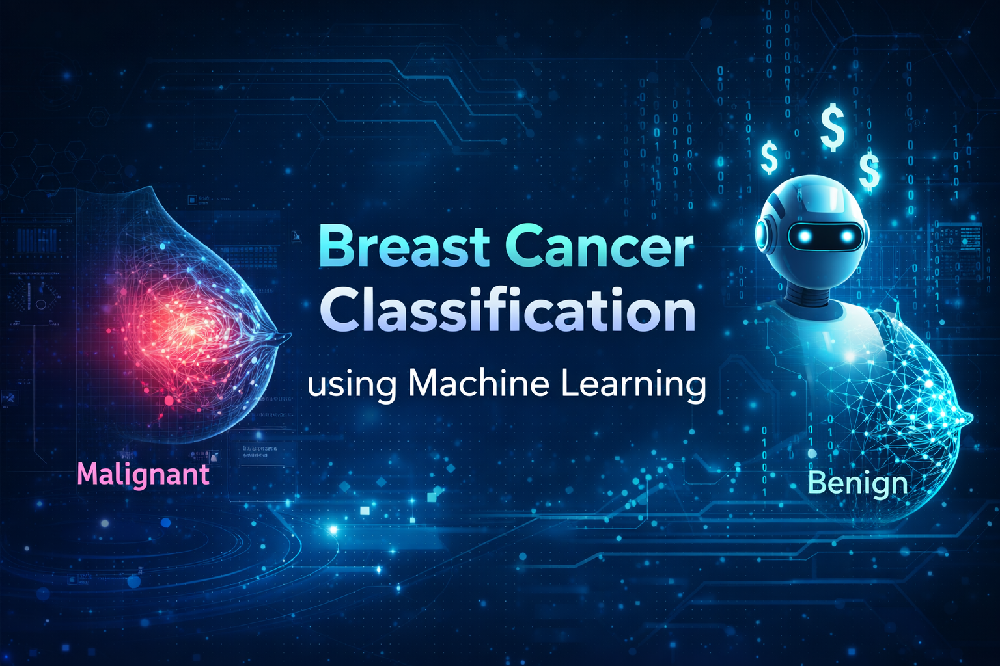

# 🎗️ Breast Cancer Detection using Machine Learning  
### Accurate Classification of Malignant vs Benign Tumors

<div align="center">
  
</div>

<div align="center">

[](https://python.org)
[](https://scikit-learn.org)
[](#)
[](LICENSE)

</div>

---

## Project Overview

The **Breast Cancer Detection** project is a machine learning classification system designed to **accurately distinguish between malignant and benign tumors** using diagnostic features extracted from breast mass images.

The project demonstrates a **complete end-to-end ML workflow**, including:
- exploratory data analysis,
- feature engineering,
- preprocessing pipelines,
- multi-model evaluation,
- cross-validation,
- and final model selection.

It is especially useful for:
- students learning classification pipelines,
- practitioners exploring healthcare ML applications,
- and anyone interested in building clean, reproducible ML projects.

---

## Why This Project Matters

Early and accurate detection of breast cancer can significantly improve treatment outcomes and survival rates.  
Manual diagnosis is time-consuming and subject to variability, while machine learning offers **fast, consistent, and data-driven decision support**.

This project highlights how classical ML models can:
- achieve **high diagnostic accuracy**,  
- reduce false negatives,  
- and support medical professionals in decision-making.

---

## Dataset Overview

This project uses the **built-in Breast Cancer dataset from scikit-learn**, which contains **real diagnostic measurements** computed from digitized images of breast mass biopsies.

### Target Classes
- **0** → Malignant  
- **1** → Benign  

### Dataset Characteristics
- 569 samples  
- 30 numerical diagnostic features  
- Clean dataset with no missing values  

---

## Repository Structure

```text
.
📁 Breast_Cancer_Detection/
├── banner.png
├── README.md
├── LICENSE
├── requirements.txt
├── notebook/
│   └── breast_cancer_detection.ipynb
└── models/
    └── best_breast_cancer_model.pkl
````

---

## Feature Engineering & Processing

### Data Exploration

* Target class distribution analysis
* Feature visualization to understand separability
* Correlation inspection

### Feature Creation

* Ordinal feature: tumor size category (Small / Medium / Large)
* Nominal feature: texture type (Smooth / Rough)

### Preprocessing Pipeline

* Standard scaling for numerical features
* Ordinal encoding for ordered categorical features
* One-hot encoding for nominal categorical features

All transformations are combined using a **ColumnTransformer**.

---

## Model Selection & Evaluation

Multiple classification models were trained and evaluated using **5-fold cross-validation** and a held-out test set.

### Models Evaluated

* Logistic Regression (L1, L2)
* Support Vector Machine (SVM)
* K-Nearest Neighbors (KNN)
* Decision Tree
* Random Forest

The final model was selected based on **test accuracy** and generalization performance.

The trained model is saved as:

```text
best_breast_cancer_model.pkl
```

---

## Results Summary

* Strong separation between malignant and benign classes
* High classification accuracy
* Robust performance through cross-validation
* Reproducible end-to-end ML pipeline

---

## Run Locally

```bash
git clone https://github.com/harisyar-ai/breast-cancer-detection.git
cd breast-cancer-detection
pip install -r requirements.txt
```

---

## Future Improvements

* Add ROC curve and AUC visualization
* Integrate SHAP for explainability
* Deploy as a web application
* Explore ensemble stacking

---

```
Developed by Muhammad Haris Afridi
February 2026

Stars ⭐ and feedback are highly appreciated
github.com/harisyar-ai
```
